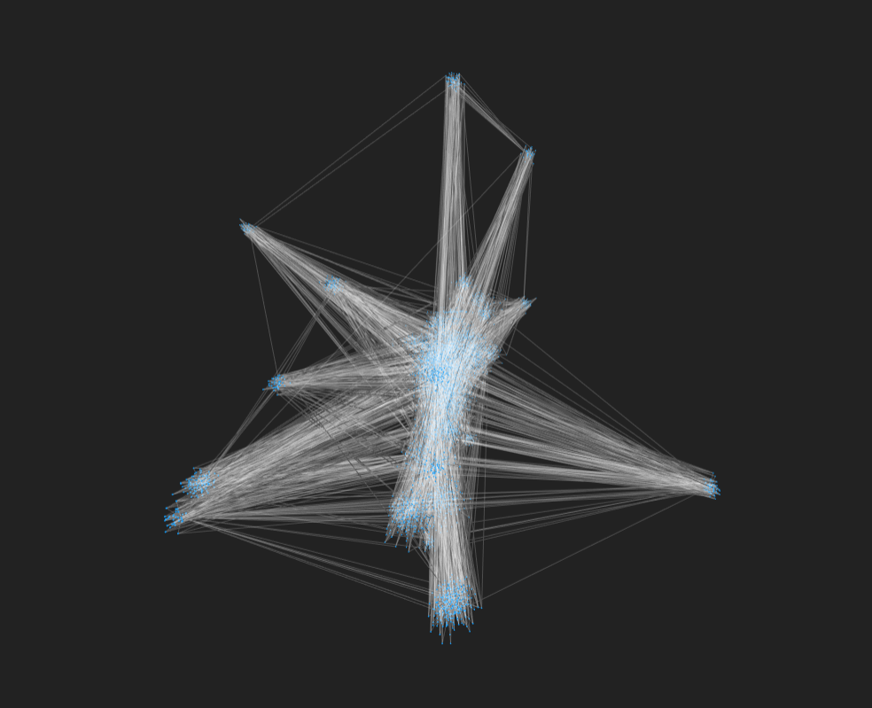
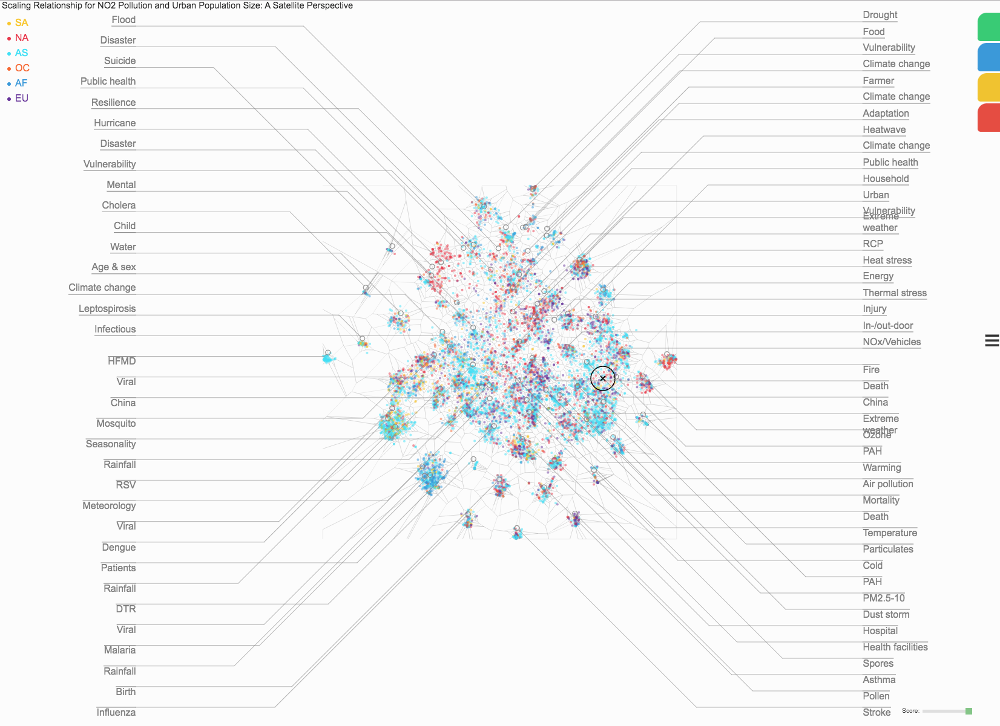
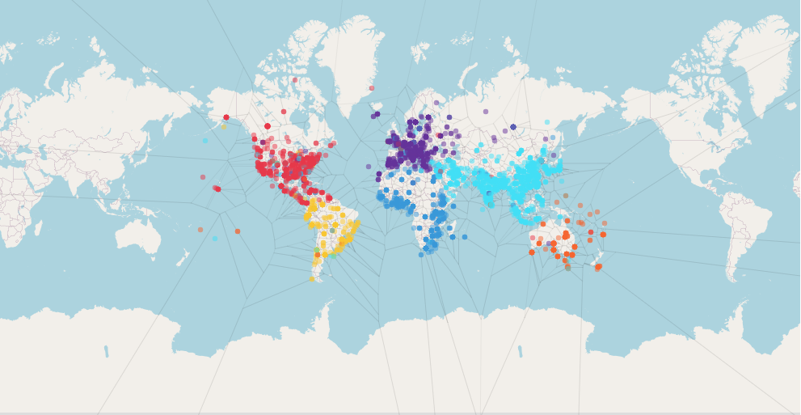
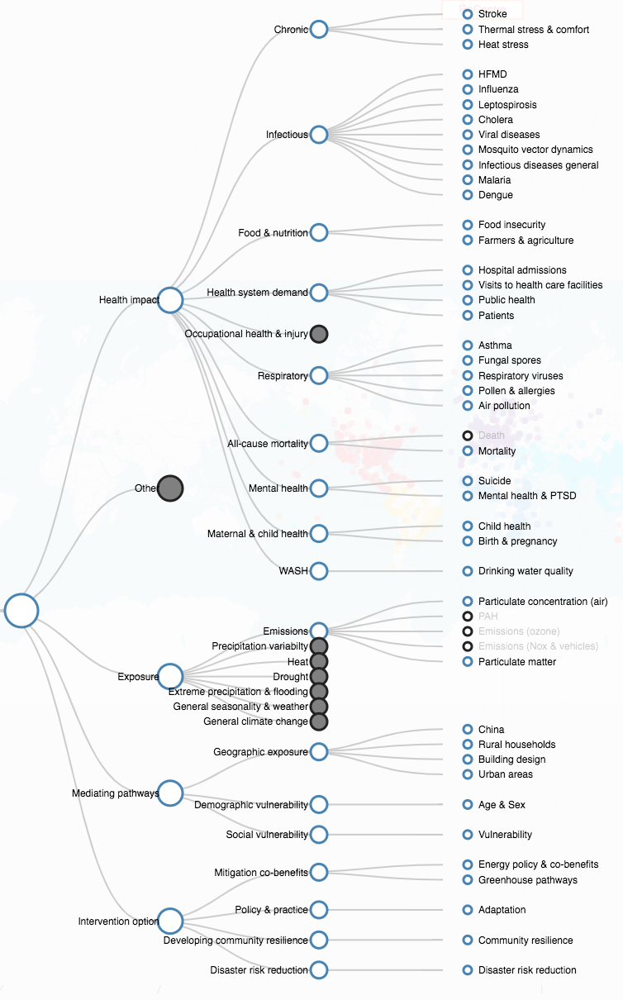

# DIFID
<a href='https://cemac.github.io/DIFID/ui/'>https://cemac.github.io/DIFID/ui/</a>

## Background
As part of the DIFID project papers are fed into a NLP algorithm to generate a set of weighted topics. Plotting these as a graph we can see that topics tend to be grouped in a hierarchical structure.  

Using a dimensionality reduction algorithm (t-SNE), it is possible to achieve much the same result, displaying like papers together. This is shown as part of the DIFID app at the link above. 

Within this we can also display items geographically.

And even filter by topic

### Sidebar options
- (green) world map : positions based on paper/topic/author location
- (green) t-sne plot
- (blue) show hide t-sne labels
- (yellow) filter points by continents
- (red) filter points by topic hierarchy
- (triple dash) fuzzy matching search-select points/papers

### Mouse 
- (mouseover) display paper name at the top 
- (scroll) zoom in/out 
- (doubleclick) open paper in google scholar  

### score slider
filter points based on topic importance (highest - lowest)

### Filtering 
When filtering topics or continents, open and click on the respective tab. 

Once open, deselect all items you do not wish to display. 

To view map open and click on the tab again. 

# Note 
-hierarchy in csv format id,l1,l2,l3
